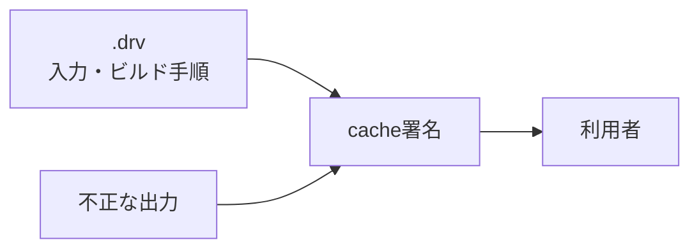

# 説明

---

# 自己紹介

  

    
    <h2 class="text-gray-500 font-bold mt-4">@akazdayo</h2>
    <h1 class="mt-2">あかず</h1>
  

  

    <h2>趣味</h2>
    

      <ul>
        <li>
          技術
          <ul>
            <li>Nix</li>
            <li>分散SNS</li>
            <li>インフラ(最近始めた)</li>
          </ul>
        </li>
        <li>ゲーム
          <ul>
            <li>osu!</li>
            <li>VRChat</li>
            <li>etc...</li>
          </ul>
        </li>
      </ul>
    

  

---

# 1. 背景

- Nixにはつらいところが多すぎる
  - すべてをサンドボックスでビルドするためオーバーヘッドが大きい
  - キャッシュの再利用性が低い
  - ディスク容量を大きく消費する

---

# それを解決するには

- バイナリキャッシュという仕組みがある
  - Nixは入力から同一の出力をほぼ保証している

- 手順
  - 1.入力データをキャッシュサーバーに問い合わせ、署名済みバイナリキャッシュを求める
  - 2.バイナリキャッシュの署名を検証、ユーザーが信頼するものであれば承認
  - 3.インストール

- **出力のハッシュ値はビルドしないとわからない**

---

# バイナリキャッシュの課題

- キャッシュ利用者は署名鍵への盲目的な信頼が必要となる
  - 信頼した鍵が不正なキャッシュを投稿しても見抜けない (出力のハッシュ値はビルドしないとわからないため)
    - 利用者が多い特定の大規模リポジトリにユーザーが集中する
- 小規模リポジトリは、ユーザー数が少ないため信頼のための検討材料が少ない
  - キャッシュを持ちにくいため、大規模リポジトリに対する依存が深まる

---

# 2. 目的

- 現状は、信頼する/しないの二値であるため、
- **cache運営者を盲信せず、成果物ごとの信頼性を判断できる指標を作りたい**

---

# 3. 問題の構造

- Nixの入力は`.drv`として固定される
  - 依存関係、builder、環境変数、ビルド手順などが含まれる
  - **出力内容の正しさは、実際にビルドしないと確認できない**

---

# 署名だけでは足りない理由

- 利用者が検証できるのは、基本的に署名とハッシュの整合性
- 署名鍵を信頼した時点で、不正な出力も受け入れてしまう可能性がある
- つまり現在の信頼の単位は「成果物」ではなく「cache運営者」

---

# 4. 理論: 何を証明したいか

- 目標は「成果物が正しい」と断言することではない
- 代わりに、成果物ごとに以下の証拠を集める
  - `drv`: どの入力をビルドしたか
  - `output hash`: どの出力が得られたか
  - `environment`: どの実行環境でビルドしたか
  - `attestation`: TEE内で実行されたことの証拠
  - `builder identity`: 誰・どの鍵・どのTEEが証明したか
- これらを集約して、利用者が判断できる信頼スコアにする

---

# 5. 理論: スコア化

- 成果物 `A` に対して、同じ `drv` から同じ `output hash` を報告した証拠を集める
- スコアは単純な多数決ではなく、以下を重みとして使う
  - 出力一致数
  - builderの独立性
  - TEE種別・vendorの分散

---

# 6. ざっくり仮説

- 実際にビルドしたことを検証可能なデータを作成
- そのデータを分散台帳上にアップロード
- 利用者は信頼するか否かの指標を得られる

---

# 実際にビルドしたことを検証するには

以下が使えそう

- TEE
- ゼロ知識証明
- ログ公開

だけど、ゼロ知識証明は難しそう

- LinuxをまるっとSandboxして動かす感じになるので処理が重そう
- zkVMはRISC-V向けが主流である

---

# 7. 不安点

- TEEだけではSybil攻撃に対する完全な耐性になれなさそう
  - CPUプロバイダを完全信頼することになる
  - TEEの脆弱性が無いとは言えない
  - TEEを借りることは容易である
    - Azure Confidential Computing
    - Google Cloud Confidential VM
    - など

---

# 8. 相談したいこと

- TEEをどこまで信頼するか
- Sybilをどうやって完全に防ぐか
- 見るべき先行研究
